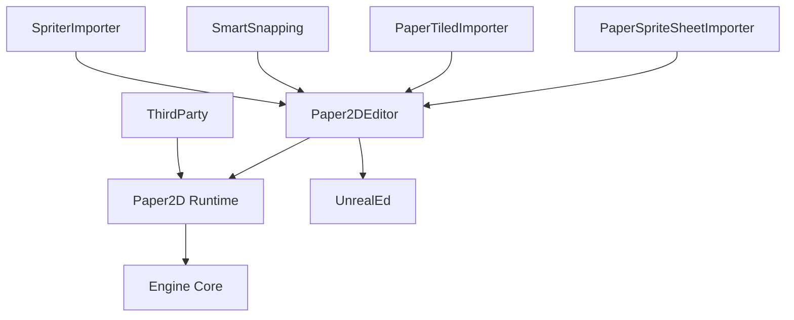
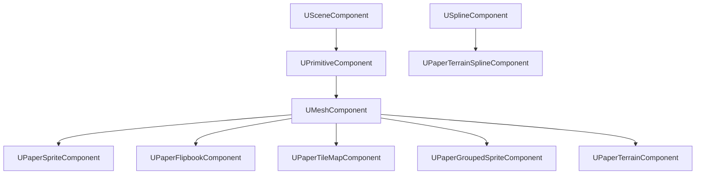

# Paper2D Plugin - Comprehensive Documentation

> [!NOTE]
> This documentation provides a complete overview of the Paper2D plugin for Unreal Engine 5.6, including architecture, modules, classes, and usage guidelines.

## Table of Contents

1. [Overview](#overview)
2. [Repository Structure](#repository-structure)
3. [Module Architecture](#module-architecture)
4. [Core Components](#core-components)
5. [Key Classes Reference](#key-classes-reference)
6. [Content Assets](#content-assets)
7. [Build Configuration](#build-configuration)
8. [Usage Guidelines](#usage-guidelines)
9. [Technical Details](#technical-details)

---

## Overview

**Paper2D** is an official Unreal Engine plugin developed by Epic Games for creating 2D games. It provides a comprehensive suite of tools and assets for 2D game development, including:

- **Sprite rendering and animation** - Create and animate 2D sprites with flipbook animations
- **Tilemap support** (experimental) - Build 2D levels with tilemap editors
- **2D collision detection** - Full collision support for 2D sprites and tilemaps
- **Multiple import formats** - Import various sprite sheet formats and external tools
- **Editor integration** - Full Unreal Editor support with custom viewports and tools

### Plugin Information

| Property | Value |
|----------|-------|
| **Version** | 1.0 |
| **Category** | 2D |
| **Developer** | Epic Games, Inc. |
| **Enabled by Default** | Yes |
| **Contains Content** | Yes |
| **Status** | Production-ready (some features experimental) |

---

## Repository Structure

```
Paper2D/
├── Binaries/              # Compiled plugin binaries
├── Config/                # Plugin configuration files
│   └── BasePaper2D.ini    # Core redirects and settings
├── Content/               # Default materials, textures, and assets
│   ├── Icons/             # Editor UI icons
│   ├── PlaceholderTextures/
│   ├── Tutorial/          # Tutorial assets
│   └── [Materials]        # Default sprite materials (lit/unlit, masked/translucent)
├── Intermediate/          # Build intermediates
├── Resources/             # Plugin resources
├── Source/                # C++ source code (7 modules)
│   ├── Paper2D/           # Runtime module
│   ├── Paper2DEditor/     # Editor module
│   ├── PaperSpriteSheetImporter/
│   ├── PaperTiledImporter/
│   ├── SmartSnapping/
│   ├── SpriterImporter/
│   └── ThirdParty/
├── Paper2D.uplugin        # Plugin manifest
└── project-logs/          # Project documentation
```

### Directory Breakdown

#### Config Directory

Contains [BasePaper2D.ini](file:///e:/Unreal%20Engine/UE_5.6/Engine/Plugins/2D/Paper2D/Config/BasePaper2D.ini) with class and property redirects for backward compatibility:

- Legacy class redirects (e.g., `PaperAnimatedRenderComponent` → `PaperFlipbookComponent`)
- Property name updates for renamed fields
- Ensures older projects load correctly with newer versions

#### Content Directory (31 assets)

Pre-built materials and assets for immediate use:

**Default Materials:**
- `DefaultSpriteMaterial.uasset` - Standard unlit sprite material
- `DefaultLitSpriteMaterial.uasset` - Lit sprite material with lighting support
- `MaskedUnlitSpriteMaterial.uasset` - Alpha-masked unlit material
- `MaskedLitSpriteMaterial.uasset` - Alpha-masked lit material
- `OpaqueUnlitSpriteMaterial.uasset` - Opaque unlit material
- `OpaqueLitSpriteMaterial.uasset` - Opaque lit material
- `TranslucentUnlitSpriteMaterial.uasset` - Translucent unlit material
- `TranslucentLitSpriteMaterial.uasset` - Translucent lit material
- `DefaultPaperTerrainMaterial.uasset` - Material for terrain rendering

**Assets:**
- `DummySprite.uasset` - Placeholder sprite for testing
- `DummySpriteTexture.uasset` - Placeholder texture

#### Source Directory (7 modules, 265+ files)

Contains all C++ implementation for the plugin across multiple modules.

---

## Module Architecture

The Paper2D plugin is composed of **7 distinct modules**, each serving specific purposes:



### 1. Paper2D (Runtime Module)

**Type:** Runtime  
**Loading Phase:** PreDefault  
**Location:** [Source/Paper2D](file:///e:/Unreal%20Engine/UE_5.6/Engine/Plugins/2D/Paper2D/Source/Paper2D)

The core runtime module providing all gameplay functionality for 2D games.

**Dependencies:**
- Core
- CoreUObject
- Engine
- RenderCore
- RHI
- SlateCore
- Slate
- NavigationSystem
- Renderer (private)
- EditorFramework (editor only)
- UnrealEd (editor only)

**Structure:**
```
Paper2D/
├── Classes/        # 25 header files - Public API classes
├── Private/        # 40 implementation files
├── Public/         # 3 public headers
└── Paper2D.Build.cs
```

**Key Responsibilities:**
- Sprite rendering and management
- Flipbook animation playback
- Tilemap rendering and management
- 2D collision detection and physics
- Component and actor implementations
- Material and texture handling
- Scene proxy rendering

### 2. Paper2DEditor (Editor Module)

**Type:** Editor  
**Loading Phase:** Default  
**Location:** [Source/Paper2DEditor](file:///e:/Unreal%20Engine/UE_5.6/Engine/Plugins/2D/Paper2D/Source/Paper2DEditor)

Provides all editor tools, viewports, and asset management for 2D content.

**Structure:**
```
Paper2DEditor/
├── Classes/        # 14 header files - Editor APIs
├── Private/        # 146 implementation files
├── Public/         # 3 public headers
└── Paper2DEditor.Build.cs
```

**Key Responsibilities:**
- Sprite editor viewport and tools
- Flipbook editor and timeline
- Tilemap editor with painting tools
- Asset factories for creating Paper2D assets
- Thumbnail renderers for Content Browser
- Import/export functionality
- Editor customizations and UI

### 3. PaperSpriteSheetImporter (Editor Module)

**Type:** Editor  
**Loading Phase:** Default  
**Location:** [Source/PaperSpriteSheetImporter](file:///e:/Unreal%20Engine/UE_5.6/Engine/Plugins/2D/Paper2D/Source/PaperSpriteSheetImporter)

Handles importing sprite sheets from various formats.

**Structure:**
```
PaperSpriteSheetImporter/
├── Private/        # 12 implementation files
└── PaperSpriteSheetImporter.Build.cs
```

**Supported Formats:**
- JSON-based sprite sheet descriptors
- Atlas texture imports
- Automatic sprite extraction from sheets

### 4. PaperTiledImporter (Editor Module)

**Type:** Editor  
**Loading Phase:** Default  
**Location:** [Source/PaperTiledImporter](file:///e:/Unreal%20Engine/UE_5.6/Engine/Plugins/2D/Paper2D/Source/PaperTiledImporter)

Imports tilemaps created with the Tiled map editor.

**Structure:**
```
PaperTiledImporter/
├── Private/        # 5 implementation files
└── PaperTiledImporter.Build.cs
```

**Features:**
- Tiled Map Editor (.tmx) file import
- Automatic tileset creation
- Layer preservation
- Properties and metadata import

### 5. SmartSnapping (Editor Module)

**Type:** Editor  
**Loading Phase:** PostEngineInit  
**Location:** [Source/SmartSnapping](file:///e:/Unreal%20Engine/UE_5.6/Engine/Plugins/2D/Paper2D/Source/SmartSnapping)

Provides intelligent snapping functionality for the editor.

**Structure:**
```
SmartSnapping/
├── Private/        # 4 implementation files
└── SmartSnapping.Build.cs
```

**Features:**
- Grid snapping for sprites and tiles
- Socket-based snapping
- Vertex snapping
- Pixel-perfect alignment tools

### 6. SpriterImporter (Editor Module)

**Type:** Editor  
**Loading Phase:** Default  
**Location:** [Source/SpriterImporter](file:///e:/Unreal%20Engine/UE_5.6/Engine/Plugins/2D/Paper2D/Source/SpriterImporter)

Imports animations from Spriter (skeletal 2D animation tool).

**Structure:**
```
SpriterImporter/
├── Private/        # 9 implementation files
└── SpriterImporter.Build.cs
```

**Features:**
- Spriter file format (.scml) import
- Skeletal animation conversion
- Timeline and keyframe preservation

### 7. ThirdParty

**Location:** [Source/ThirdParty](file:///e:/Unreal%20Engine/UE_5.6/Engine/Plugins/2D/Paper2D/Source/ThirdParty)

Contains third-party libraries and dependencies used by the plugin.

---

## Core Components

Paper2D provides several component types for different 2D rendering needs:

### Component Hierarchy



### UPaperSpriteComponent

Renders a single static sprite.

**Features:**
- Single sprite rendering
- Material override support
- Collision detection (2D/3D)
- Socket support
- Blueprint-accessible

**Common Use Cases:**
- Static background elements
- UI elements in 3D space
- Non-animated sprites
- Collectibles and pickups

### UPaperFlipbookComponent

Renders animated sprite sequences (flipbooks).

**Features:**
- Frame-based animation playback
- Variable frame rates
- Animation events
- Looping control
- Collision modes (No collision, First frame, Each frame)

**Common Use Cases:**
- Character animations
- Animated environmental objects
- Effects and particles
- Any frame-by-frame animation

### UPaperTileMapComponent

Renders tile-based maps.

**Features:**
- Multiple layer support
- Various projection modes (Orthogonal, Isometric Diamond, Isometric Staggered, Hexagonal Staggered)
- Per-layer rendering
- Collision generation
- Runtime tile manipulation

**Common Use Cases:**
- 2D level geometry
- Background and foreground layers
- Platformer levels
- Top-down game maps

### UPaperGroupedSpriteComponent

Efficiently renders multiple sprites as a single draw call.

**Features:**
- Batch rendering for performance
- Multiple sprite instances
- Shared material
- Reduced draw calls

**Common Use Cases:**
- Large numbers of static sprites
- Background decoration
- Performance-critical scenarios

### UPaperTerrainComponent + UPaperTerrainSplineComponent

Renders deformable 2D terrain using splines.

**Features:**
- Spline-based terrain definition
- Automatic mesh generation
- Collision support
- Material mapping

**Common Use Cases:**
- Hills and terrain in side-scrollers
- Destructible terrain
- Caves and underground sections

---

## Key Classes Reference

### Sprite Classes

#### UPaperSprite

**File:** [Source/Paper2D/Classes/PaperSprite.h](file:///e:/Unreal%20Engine/UE_5.6/Engine/Plugins/2D/Paper2D/Source/Paper2D/Classes/PaperSprite.h)

The fundamental sprite asset class.

**Key Properties:**
- `SourceTexture` - Source texture reference (editor only)
- `SourceUV` - Position within texture (pixels)
- `SourceDimension` - Size within texture (pixels)
- `DefaultMaterial` - Material to use for rendering
- `AlternateMaterial` - Second material for diced geometry
- `PixelsPerUnrealUnit` - Scaling factor (e.g., 0.64 = 64 pixels = 100cm)
- `SpriteCollisionDomain` - Collision type (None, 2D, 3D)
- `Sockets` - Attachment points for components

**Key Features:**
- Texture space to pivot space conversion
- Custom pivot point support
- Trimming support (removes transparent pixels)
- Rotation in atlas support
- Custom collision geometry
- Custom render geometry
- Baked render data for performance
- Atlas grouping for texture optimization

**Editor-Only Features:**
- Collision geometry editing
- Render geometry editing (for custom shapes)
- Pivot mode selection
- Automatic contour detection
- Bounding box generation

#### UPaperSpriteAtlas

**Purpose:** Groups sprites together for texture atlas optimization.

**Features:**
- Automatic sprite packing
- Texture atlas generation
- Reduces texture memory
- Improves rendering performance

### Animation Classes

#### UPaperFlipbook

**File:** [Source/Paper2D/Classes/PaperFlipbook.h](file:///e:/Unreal%20Engine/UE_5.6/Engine/Plugins/2D/Paper2D/Source/Paper2D/Classes/PaperFlipbook.h)

Container for sprite-based animations.

**Key Properties:**
- `FramesPerSecond` - Playback speed (0-1000 FPS)
- `KeyFrames` - Array of sprite frames with durations
- `DefaultMaterial` - Material override for animation
- `CollisionSource` - Collision mode for animation

**Key Structures:**
- `FPaperFlipbookKeyFrame` - Individual frame data
  - `Sprite` - Sprite to display
  - `FrameRun` - Duration in frames (minimum 1)

**Collision Modes:**
- `NoCollision` - No collision geometry
- `FirstFrameCollision` - Static collision from first frame (recommended)
- `EachFrameCollision` - Dynamic collision per frame (expensive, not recommended)

**Key Methods:**
- `GetNumFrames()` - Total frame count
- `GetTotalDuration()` - Animation duration in seconds
- `GetKeyFrameIndexAtTime()` - Find frame at specific time
- `GetSpriteAtTime()` - Get sprite at specific time
- `GetSpriteAtFrame()` - Get sprite at frame index

**Socket Support:**
- Inherits sockets from individual sprite frames
- Socket queries per-frame
- Used for attaching weapons, effects, etc.

### Tilemap Classes

#### UPaperTileMap

**File:** [Source/Paper2D/Classes/PaperTileMap.h](file:///e:/Unreal%20Engine/UE_5.6/Engine/Plugins/2D/Paper2D/Source/Paper2D/Classes/PaperTileMap.h)

2D grid-based tile map asset.

**Key Properties:**
- `MapWidth` / `MapHeight` - Map dimensions in tiles (1-1024)
- `TileWidth` / `TileHeight` - Tile dimensions in pixels
- `PixelsPerUnrealUnit` - Scaling factor
- `SeparationPerTileX` / `SeparationPerTileY` - Z-separation for depth sorting
- `SeparationPerLayer` - Z-separation between layers
- `TileLayers` - Array of tile layers
- `Material` - Default material for rendering
- `ProjectionMode` - Rendering projection type
- `CollisionThickness` - Extrusion for 3D collision
- `SpriteCollisionDomain` - Collision type

**Projection Modes:**
- `Orthogonal` - Standard square grid (fully supported)
- `IsometricDiamond` - Diamond-shaped isometric (fully supported)
- `IsometricStaggered` - Staggered isometric (not fully supported)
- `HexagonalStaggered` - Hexagonal grid (not fully supported)

**Key Methods:**
- `GetTileCoordinatesFromLocalSpacePosition()` - World to tile conversion
- `GetTilePositionInLocalSpace()` - Tile to world conversion (corner)
- `GetTileCenterInLocalSpace()` - Tile to world conversion (center)
- `GetTilePolygon()` - Get vertices for tile shape
- `AddNewLayer()` - Create new tile layer
- `ResizeMap()` - Change map dimensions
- `RebuildCollision()` - Regenerate collision geometry

**Editor Features:**
- Background color customization
- Multiple grid overlays (tile grid, multi-tile grid, layer grid)
- Layer selection and management
- Asset import data tracking

#### UPaperTileLayer

**Purpose:** Individual layer within a tile map.

**Features:**
- Layer name and visibility
- Tile data storage (grid of tile references)
- Per-layer opacity
- Layer ordering

#### UPaperTileSet

**Purpose:** Collection of tiles that can be placed in tile maps.

**Features:**
- Tile definitions with source textures
- Tile metadata
- Per-tile collision data
- Tile properties

### Actor Classes

Paper2D provides actor classes for easy placement in levels:

#### APaperSpriteActor

**Purpose:** Actor containing a `UPaperSpriteComponent`.

**Use Case:** Placing static sprites in levels.

#### APaperFlipbookActor

**Purpose:** Actor containing a `UPaperFlipbookComponent`.

**Use Case:** Placing animated sprites in levels.

#### APaperTileMapActor

**Purpose:** Actor containing a `UPaperTileMapComponent`.

**Use Case:** Placing tilemaps in levels.

#### APaperGroupedSpriteActor

**Purpose:** Actor containing a `UPaperGroupedSpriteComponent`.

**Use Case:** Placing batched sprite collections.

#### APaperTerrainActor

**Purpose:** Actor containing `UPaperTerrainComponent` and `UPaperTerrainSplineComponent`.

**Use Case:** Creating deformable 2D terrain.

#### APaperCharacter

**Purpose:** Character class optimized for 2D games.

**Features:**
- Inherits from `ACharacter`
- Contains `UPaperFlipbookComponent` instead of mesh
- Full character movement support
- Collision and physics
- Blueprint-friendly

**Use Case:** Player characters and NPCs in 2D games.

### Render Proxies

Internal rendering classes (not directly used by developers):

- `FPaperSpriteSceneProxy` - Sprite rendering
- `FPaperFlipbookSceneProxy` - Flipbook rendering
- `FGroupedSpriteSceneProxy` - Batched sprite rendering
- `FPaperRenderSceneProxy` - Base rendering class

### Blueprint Libraries

#### UPaperSpriteBlueprintLibrary

Utility functions for working with sprites in Blueprints.

#### UTileMapBlueprintLibrary

Utility functions for working with tilemaps in Blueprints.

**Key Functions:**
- Tile manipulation
- Layer queries
- Runtime tilemap editing

### Utility Classes

#### FIntMargin

**Purpose:** Integer-based margin struct for UI and layout.

**Properties:**
- Left, Right, Top, Bottom margins

#### FSpriteDrawCall

**Purpose:** Represents a batched sprite draw call for rendering.

#### FPaperSpriteSocket

**Purpose:** Defines an attachment point on a sprite.

**Properties:**
- `SocketName` - Unique identifier
- `LocalTransform` - Transform in pivot space

---

## Content Assets

### Default Materials

Paper2D includes 8 pre-configured sprite materials covering common rendering scenarios:

| Material | Blend Mode | Lighting | Alpha | Use Case |
|----------|-----------|----------|-------|----------|
| DefaultSpriteMaterial | Translucent | Unlit | Yes | Standard sprites with transparency |
| DefaultLitSpriteMaterial | Translucent | Lit | Yes | Sprites affected by lighting |
| MaskedUnlitSpriteMaterial | Masked | Unlit | Binary | Hard-edged sprites, no lighting |
| MaskedLitSpriteMaterial | Masked | Lit | Binary | Hard-edged sprites with lighting |
| OpaqueUnlitSpriteMaterial | Opaque | Unlit | No | Solid sprites, no transparency |
| OpaqueLitSpriteMaterial | Opaque | Lit | No | Solid sprites with lighting |
| TranslucentUnlitSpriteMaterial | Translucent | Unlit | Yes | Transparent unlit effects |
| TranslucentLitSpriteMaterial | Translucent | Lit | Yes | Transparent lit effects |

**Material Selection Guide:**

1. **Most 2D games:** `DefaultSpriteMaterial` (unlit, translucent)
2. **Pixel art with hard edges:** `MaskedUnlitSpriteMaterial`
3. **2.5D games with lighting:** `DefaultLitSpriteMaterial` or `MaskedLitSpriteMaterial`
4. **UI elements:** `OpaqueUnlitSpriteMaterial` or `TranslucentUnlitSpriteMaterial`
5. **Special effects:** `TranslucentUnlitSpriteMaterial`

### Icons

Editor UI icons located in `Content/Icons/`:
- Asset type icons for Content Browser
- Toolbar icons for Paper2D tools
- Viewport icons and gizmos

---

## Build Configuration

### Paper2D.uplugin

**File:** [Paper2D.uplugin](file:///e:/Unreal%20Engine/UE_5.6/Engine/Plugins/2D/Paper2D/Paper2D.uplugin)

Plugin manifest defining all modules and metadata.

**Module Loading Configuration:**

| Module | Type | Loading Phase | Purpose |
|--------|------|---------------|---------|
| Paper2D | Runtime | PreDefault | Core runtime functionality |
| Paper2DEditor | Editor | Default | Editor tools and UI |
| PaperSpriteSheetImporter | Editor | Default | Sprite sheet import |
| PaperTiledImporter | Editor | Default | Tiled map import |
| SmartSnapping | Editor | PostEngineInit | Snapping tools |

> [!IMPORTANT]
> Paper2D loads in the PreDefault phase to ensure it's available before most other systems initialize.

### Module Dependencies

**Paper2D (Runtime) Dependencies:**
```
Public:
  - Core
  - CoreUObject
  - Engine
  - RenderCore
  - RHI
  - SlateCore
  - Slate
  - NavigationSystem

Private:
  - Renderer
  - EditorFramework (editor builds only)
  - UnrealEd (editor builds only)
```

The runtime module has minimal dependencies, making it lightweight for packaged games.

### Build Files

Each module contains a `.Build.cs` file defining its build configuration:

- [Paper2D.Build.cs](file:///e:/Unreal%20Engine/UE_5.6/Engine/Plugins/2D/Paper2D/Source/Paper2D/Paper2D.Build.cs)
- Paper2DEditor.Build.cs
- PaperSpriteSheetImporter.Build.cs
- And others for each module

---

## Usage Guidelines

### Creating Sprites

**From Texture:**

1. Import texture to Content Browser
2. Right-click texture → **Sprite Actions** → **Extract Sprites**
3. Configure extraction settings (grid-based or automatic)
4. Generated sprites appear in Content Browser

**Manual Creation:**

1. Right-click in Content Browser → **Paper2D** → **Sprite**
2. Set source texture
3. Define source region (UV and dimensions)
4. Configure pivot point
5. Set pixels per unit
6. (Optional) Add collision geometry
7. (Optional) Add custom render geometry

**Best Practices:**

- Use power-of-two textures for better performance
- Set appropriate `PixelsPerUnrealUnit` (commonly 1.0 for pixel-perfect, or 0.64 for scale)
- Use sprite atlases for sprites that appear together
- Add collision geometry only where needed
- Use the masked material for pixel art with hard edges

### Creating Flipbooks

**Manual Creation:**

1. Right-click in Content Browser → **Paper2D** → **Flipbook**
2. Open flipbook editor
3. Add keyframes by dragging sprites to the timeline
4. Set frame duration for each keyframe
5. Configure frames per second
6. Set collision source (recommend `FirstFrameCollision`)

**From Sprite Sheet:**

1. Import sprite sheet with PaperSpriteSheetImporter
2. Automatically generates sprites and flipbook

**Best Practices:**

- Keep frame rate consistent across flipbooks (e.g., 12 FPS for pixel art)
- Use `FirstFrameCollision` for performance
- Only use `EachFrameCollision` when absolutely necessary
- Group related animations in folders
- Name flipbooks clearly (e.g., `Player_Walk`, `Player_Jump`)

### Creating Tile Maps

**Creating a Tile Map:**

1. Create or import a tile set
2. Right-click in Content Browser → **Paper2D** → **Tile Map**
3. Open tile map editor
4. Set map dimensions
5. Set tile dimensions to match tile set
6. Create layers as needed
7. Paint tiles using tile set

**Tile Set Creation:**

1. Right-click in Content Browser → **Paper2D** → **Tile Set**
2. Set source texture
3. Configure tile width/height
4. Define tile grid
5. (Optional) Add per-tile collision

**Projection Modes:**

- **Orthogonal:** Standard grid (use for platformers, top-down games)
- **Isometric Diamond:** 45° isometric view (use for isometric games)

> [!WARNING]
> Isometric Staggered and Hexagonal Staggered modes are not fully supported and may have bugs.

**Best Practices:**

- Use layers for depth (background, midground, foreground)
- Set `SeparationPerLayer` for proper depth sorting
- Use collision layers sparingly for performance
- Keep tile sets organized by theme
- Use consistent tile dimensions across tile sets

### Using Components in C++

**Adding a Sprite Component:**

```cpp
UPROPERTY(VisibleAnywhere, BlueprintReadOnly, Category = Sprite)
UPaperSpriteComponent* SpriteComponent;

// Constructor
AMyActor::AMyActor()
{
    SpriteComponent = CreateDefaultSubobject<UPaperSpriteComponent>(TEXT("SpriteComponent"));
    RootComponent = SpriteComponent;
}

// Set sprite at runtime
SpriteComponent->SetSprite(MySprite);
```

**Adding a Flipbook Component:**

```cpp
UPROPERTY(VisibleAnywhere, BlueprintReadOnly, Category = Animation)
UPaperFlipbookComponent* FlipbookComponent;

// Constructor
AMyActor::AMyActor()
{
    FlipbookComponent = CreateDefaultSubobject<UPaperFlipbookComponent>(TEXT("FlipbookComponent"));
    RootComponent = FlipbookComponent;
}

// Play animation
FlipbookComponent->SetFlipbook(MyFlipbook);
FlipbookComponent->Play();
```

**Adding a Tile Map Component:**

```cpp
UPROPERTY(VisibleAnywhere, BlueprintReadOnly, Category = TileMap)
UPaperTileMapComponent* TileMapComponent;

// Constructor
AMyActor::AMyActor()
{
    TileMapComponent = CreateDefaultSubobject<UPaperTileMapComponent>(TEXT("TileMapComponent"));
    RootComponent = TileMapComponent;
}

// Set tile map
TileMapComponent->SetTileMap(MyTileMap);
```

### Using APaperCharacter

**Header File:**

```cpp
UCLASS()
class MYGAME_API AMyCharacter : public APaperCharacter
{
    GENERATED_BODY()

public:
    AMyCharacter();

    virtual void Tick(float DeltaTime) override;
    virtual void SetupPlayerInputComponent(class UInputComponent* PlayerInputComponent) override;

protected:
    void MoveRight(float Value);
    void UpdateAnimation();

    UPROPERTY(EditAnywhere, BlueprintReadOnly, Category = Animations)
    UPaperFlipbook* IdleAnimation;

    UPROPERTY(EditAnywhere, BlueprintReadOnly, Category = Animations)
    UPaperFlipbook* RunAnimation;
};
```

**Implementation:**

```cpp
AMyCharacter::AMyCharacter()
{
    // GetSprite() returns the UPaperFlipbookComponent
    GetSprite()->SetFlipbook(IdleAnimation);
}

void AMyCharacter::MoveRight(float Value)
{
    AddMovementInput(FVector(1.0f, 0.0f, 0.0f), Value);
}

void AMyCharacter::UpdateAnimation()
{
    const FVector Velocity = GetVelocity();
    const bool bIsMoving = FMath::Abs(Velocity.X) > 0.1f;

    if (bIsMoving)
    {
        GetSprite()->SetFlipbook(RunAnimation);
        // Flip sprite based on direction
        GetSprite()->SetWorldRotation(FRotator(0.0f, Velocity.X < 0.0f ? 180.0f : 0.0f, 0.0f));
    }
    else
    {
        GetSprite()->SetFlipbook(IdleAnimation);
    }
}
```

### Pixel-Perfect Rendering

**Project Settings:**

1. Open **Project Settings** → **Engine** → **Rendering**
2. Set **Anti-Aliasing Method** to **None** (or FXAA for slight smoothing)
3. **Texture Group Settings** → Set **Filter** to **Nearest** for pixel art textures

**Camera Setup:**

```cpp
// Orthographic camera for 2D
CameraComponent->ProjectionMode = ECameraProjectionMode::Orthographic;
CameraComponent->OrthoWidth = 1920.0f; // Match your target resolution
```

**Sprite Setup:**

- Set `PixelsPerUnrealUnit` consistently across all sprites
- Common values: `1.0` (pixel-perfect at 1 unit = 1 pixel), `0.64` (64 pixels = 100cm)
- Enable `bSnapPivotToPixelGrid` on sprites
- Use masked materials for hard edges

### Performance Optimization

**Sprite Atlases:**

- Group sprites that appear together into atlases
- Reduces texture switches and draw calls
- Set `AtlasGroup` on sprites to enable

**Grouped Sprite Component:**

- Use `UPaperGroupedSpriteComponent` for many static sprites
- Batches multiple sprites into single draw call
- Ideal for background decoration, particle systems

**Material Instances:**

- Create material instances rather than unique materials
- Enables material instancing optimizations
- Share materials between sprites when possible

**Tile Maps:**

- Use fewer layers when possible
- Limit collision geometry to necessary areas
- Use simpler collision shapes
- Avoid `EachFrameCollision` on flipbooks

**Texture Streaming:**

- Enable texture streaming for large sprite sheets
- Set appropriate texture groups
- Use mipmaps for scaled sprites

---

## Technical Details

### Coordinate Systems

Paper2D uses multiple coordinate systems:

**Texture Space:**
- Origin at top-left of texture
- X-axis points right
- Y-axis points down
- Units in pixels

**Pivot Space:**
- Origin at sprite pivot point
- X-axis points right
- Y-axis points up (converted from texture space)
- Units in pixels

**World Space:**
- Standard Unreal world coordinates
- X-axis forward, Y-axis right, Z-axis up
- Units in centimeters
- Sprites rendered on the XZ plane (facing +Y by default)

**Conversion:**
- `PixelsPerUnrealUnit` controls scaling between pixel and world space
- Example: `PixelsPerUnrealUnit = 0.64` means 64 pixels = 100cm world space

### Rendering Pipeline

**Sprite Rendering Flow:**

1. **UPaperSpriteComponent** → Creates → **FPaperSpriteSceneProxy**
2. Scene proxy generates render data from sprite's `BakedRenderData`
3. Render data contains triangles (vertex positions + UVs)
4. Submitted to renderer as mesh sections
5. Rendered with assigned material

**Baked Render Data:**
- Sprites pre-compute triangle data (stored in `BakedRenderData`)
- Array of `FVector4` (XY = world position relative to pivot, ZW = UV)
- Always multiple of 3 (triangles)
- Optimized for fast rendering

**Material Splitting:**
- Sprites can have alternate materials for different geometry sections
- `AlternateMaterialSplitIndex` defines where material changes
- Used for advanced rendering techniques

### Collision System

**Collision Modes:**

- `NoCollision` - No collision geometry
- `Use2DPhysics` - 2D collision (thin plane)
- `Use3DPhysics` - 3D collision with thickness

**Collision Geometry:**

- Defined in `CollisionGeometry` (FSpriteGeometryCollection)
- Stored as polygons in texture space
- Converted to physics shapes at runtime
- `CollisionThickness` extrudes 2D shapes into 3D

**Body Setup:**
- `UBodySetup` stores baked physics data
- Generated from collision geometry
- Used by physics engine for collision detection

### Navigation Integration

Paper2D sprites **do not** automatically generate navigation mesh data. For navigation:

1. Use separate collision volumes for nav mesh generation
2. Or use tile maps with collision layers
3. Generate nav mesh from those collision shapes

### Editor Extensions

**Custom Asset Types:**

The plugin registers custom asset types:
- Paper2D Sprite
- Paper2D Flipbook  
- Paper2D Tile Map
- Paper2D Tile Set
- Paper2D Sprite Atlas
- Paper2D Terrain Material

**Factories:**

Editor factories for creating/importing assets:
- `UPaperSpriteFactory`
- `UPaperFlipbookFactory`
- `UPaperTileMapFactory`
- `UPaperTileSetFactory`
- And importers for external formats

**Thumbnail Renderers:**

Custom thumbnail rendering for Content Browser:
- `UPaperSpriteThumbnailRenderer`
- `UPaperFlipbookThumbnailRenderer`
- `UPaperTileSetThumbnailRenderer`

**Editor Modes:**

Custom editor viewports and tools:
- Sprite editor with geometry editing
- Flipbook timeline editor
- Tile map painting tools
- Terrain spline editing

### Custom Version System

**FPaperCustomVersion:**

Handles serialization versioning for Paper2D assets, ensuring backward compatibility across engine versions.

### Known Limitations

> [!CAUTION]
> Be aware of these limitations when using Paper2D:

1. **Isometric and Hex Projections:** Isometric Staggered and Hexagonal Staggered tile map modes are experimental and not fully supported.

2. **EachFrameCollision:** Very expensive performance-wise, rebuilds physics state every frame. Avoid unless absolutely necessary.

3. **3D Collision Thickness:** Uniform thickness across entire sprite. Complex 3D collision requires custom physics setup.

4. **Texture Atlasing:** Manual process, no automatic runtime atlasing.

5. **Render Order:** Sprite render order based on Z-position. Careful management needed for proper layering.

6. **Lighting:** Paper2D lit materials work with standard UE lighting, but may not look ideal for all 2D art styles. Consider normal maps for better results.

7. **Mobile Performance:** On mobile, reduce draw calls aggressively (use atlases, grouped sprites).

---

## Additional Resources

### Class Documentation

For detailed API documentation, refer to the header files:

**Core Runtime Classes:**
- [PaperSprite.h](file:///e:/Unreal%20Engine/UE_5.6/Engine/Plugins/2D/Paper2D/Source/Paper2D/Classes/PaperSprite.h) - Sprite asset
- [PaperFlipbook.h](file:///e:/Unreal%20Engine/UE_5.6/Engine/Plugins/2D/Paper2D/Source/Paper2D/Classes/PaperFlipbook.h) - Flipbook animation
- [PaperTileMap.h](file:///e:/Unreal%20Engine/UE_5.6/Engine/Plugins/2D/Paper2D/Source/Paper2D/Classes/PaperTileMap.h) - Tile map
- [PaperSpriteComponent.h](file:///e:/Unreal%20Engine/UE_5.6/Engine/Plugins/2D/Paper2D/Source/Paper2D/Classes/PaperSpriteComponent.h) - Sprite component
- [PaperFlipbookComponent.h](file:///e:/Unreal%20Engine/UE_5.6/Engine/Plugins/2D/Paper2D/Source/Paper2D/Classes/PaperFlipbookComponent.h) - Flipbook component
- [PaperTileMapComponent.h](file:///e:/Unreal%20Engine/UE_5.6/Engine/Plugins/2D/Paper2D/Source/Paper2D/Classes/PaperTileMapComponent.h) - Tile map component
- [PaperCharacter.h](file:///e:/Unreal%20Engine/UE_5.6/Engine/Plugins/2D/Paper2D/Source/Paper2D/Classes/PaperCharacter.h) - 2D character

**Asset Management:**
- [PaperTileSet.h](file:///e:/Unreal%20Engine/UE_5.6/Engine/Plugins/2D/Paper2D/Source/Paper2D/Classes/PaperTileSet.h) - Tile set
- [PaperSpriteAtlas.h](file:///e:/Unreal%20Engine/UE_5.6/Engine/Plugins/2D/Paper2D/Source/Paper2D/Classes/PaperSpriteAtlas.h) - Sprite atlas
- [PaperRuntimeSettings.h](file:///e:/Unreal%20Engine/UE_5.6/Engine/Plugins/2D/Paper2D/Source/Paper2D/Classes/PaperRuntimeSettings.h) - Plugin settings

**Blueprint Libraries:**
- [PaperSpriteBlueprintLibrary.h](file:///e:/Unreal%20Engine/UE_5.6/Engine/Plugins/2D/Paper2D/Source/Paper2D/Classes/PaperSpriteBlueprintLibrary.h)
- [TileMapBlueprintLibrary.h](file:///e:/Unreal%20Engine/UE_5.6/Engine/Plugins/2D/Paper2D/Source/Paper2D/Classes/TileMapBlueprintLibrary.h)

### Epic Games Documentation

- [Unreal Engine Documentation - Paper2D](https://docs.unrealengine.com/en-US/paper-2d-in-unreal-engine/)
- [Unreal Engine API Reference](https://docs.unrealengine.com/en-US/API/)

### Community Resources

- Unreal Engine Forums - Paper2D Section
- Unreal Slackers Discord - #paper2d channel
- Epic Developer Community

---

## Version History

| Version | Engine | Notes |
|---------|--------|-------|
| 1.0 | UE 5.6 | Current version, production-ready |

---

## License

Paper2D is developed and maintained by Epic Games, Inc. and is included with Unreal Engine under the Unreal Engine EULA.

---

*Documentation generated on 2025-12-07*  
*Repository: Paper2D Plugin for Unreal Engine 5.6*  
*Location: `e:\Unreal Engine\UE_5.6\Engine\Plugins\2D\Paper2D`*
